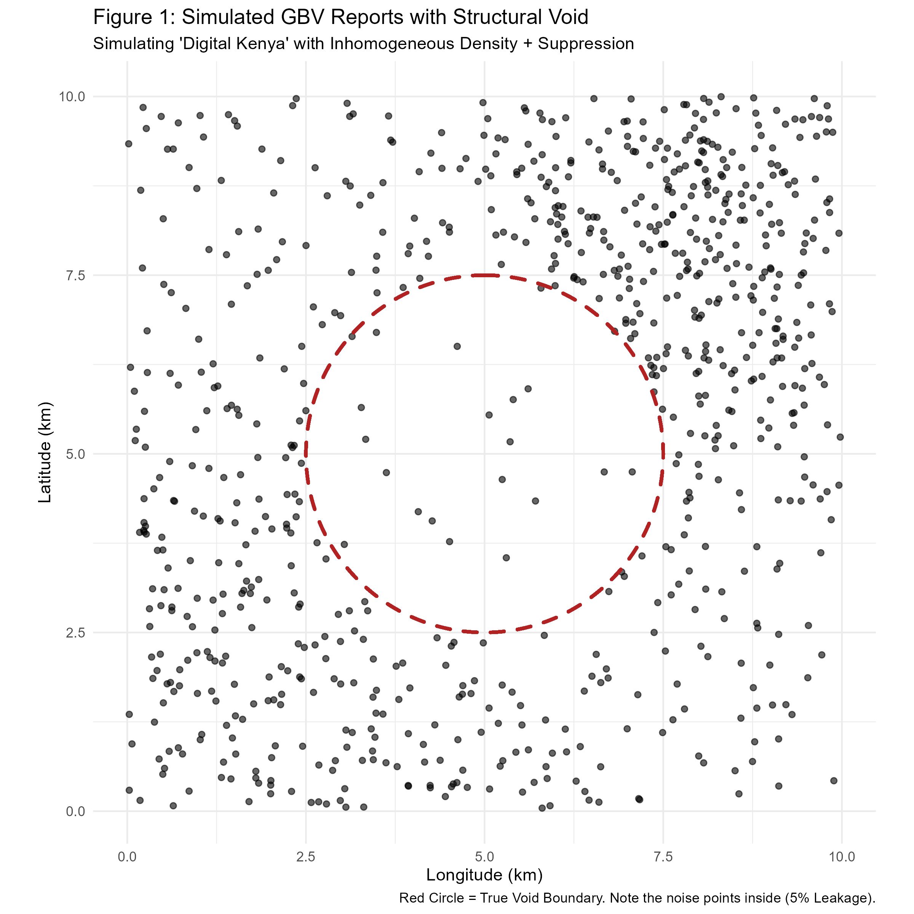
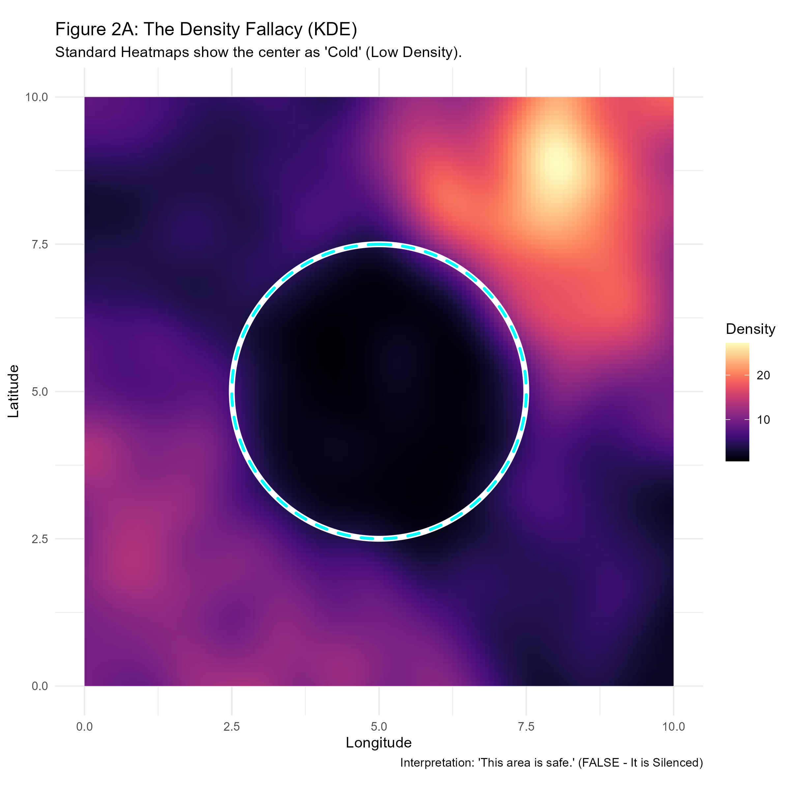
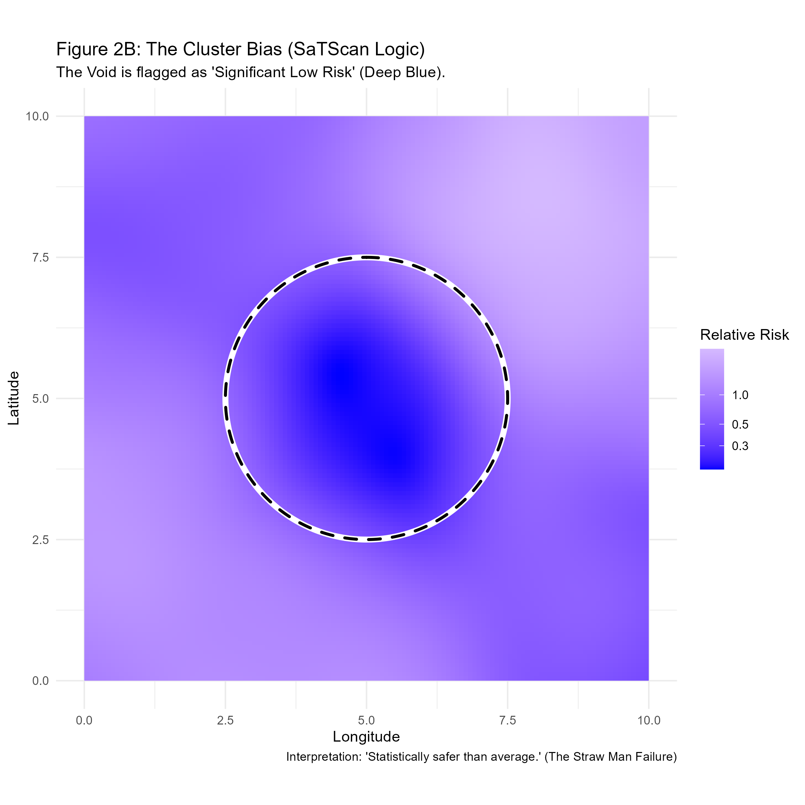
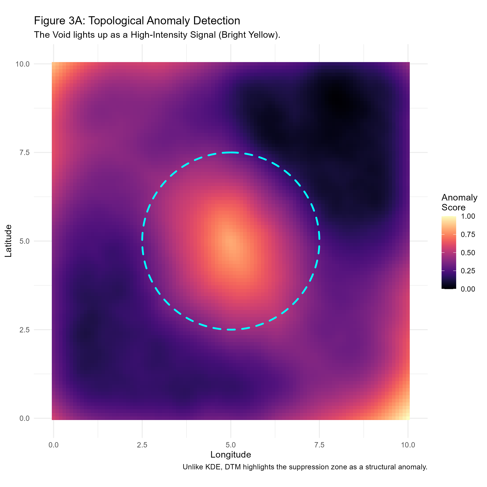
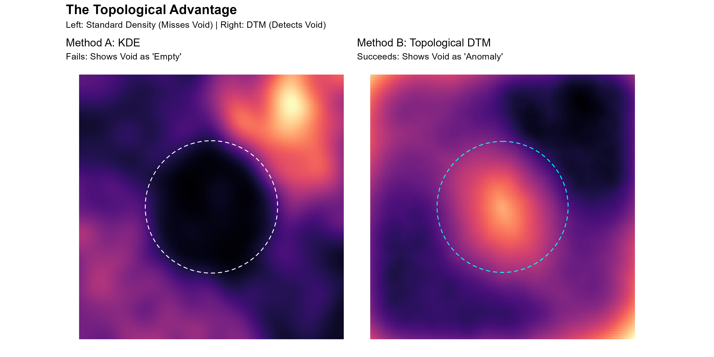
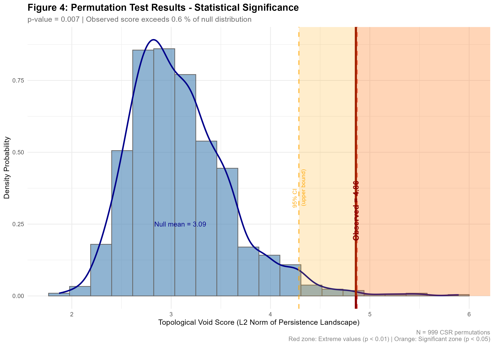
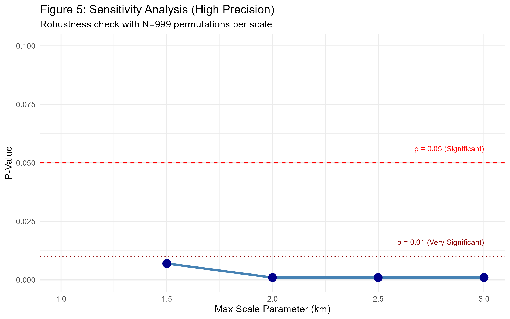
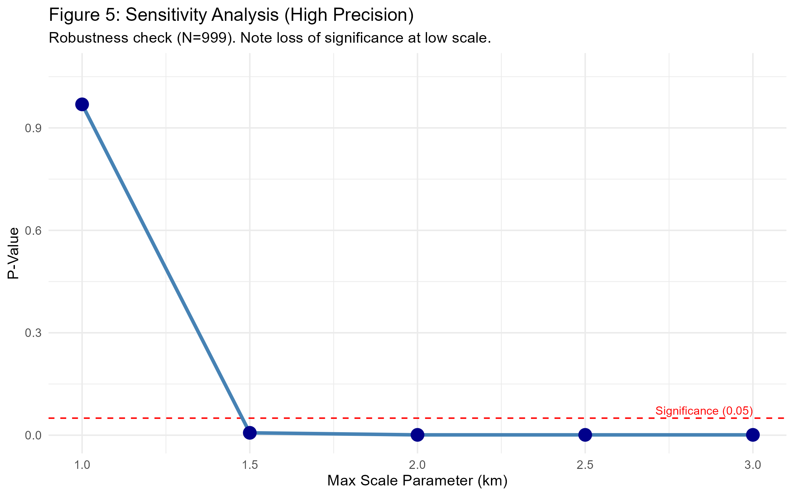

[](https://doi.org/10.5281/zenodo.18244299)
[](https://doi.org/10.5281/zenodo.18228387)

##  Table of Contents

- [1. Abstract & Rationale](#1-abstract--epidemiological-rationale)
- [2. Novelty & Contribution](#2-novelty--contribution-statement)
- [3. Quick Start](#quick-start-reproducing-results)
- [4. Methodology (Phases 1-5)](#4-phase-1-the-digital-laboratory-simulation)
- [5. Key Results](#10-key-results-summary)
- [6. Citation](#citation)

# Topological Inference for Detecting Structural Voids in Spatially Censored Epidemiological Data

**Sole Investigator:** Grold Otieno Mboya  
**Manuscript Status:** This repository accompanies the preprint **"The Geometry of Silence"** (DOI: 10.5281/zenodo.18228387). The code and documentation here allow full reproduction of all results, figures, and analyses presented in the manuscript.  
**Status:** Complete (Phases 1–5)

---

## 1. Abstract & Epidemiological Rationale
In conflict-affected regions, disease surveillance data is rarely complete. It is often **Censored Not at Random (CNAR)**. High-risk zones controlled by warlords or subject to extreme stigma frequently report *zero* cases—not because the population is healthy, but because they are silenced.

**The Core Issue:** Standard epidemiological tools like Kernel Density Estimation (KDE) and SaTScan rely on **Spatial Scan Statistic Logic**. They assume that a low case count implies low risk. When you feed them censored data, these tools misclassify "Structural Voids" (silenced zones) as "Low-Risk Clusters." This is a dangerous error that can divert humanitarian aid away from the specific areas that need it most.

**My Solution:** I developed a framework using **Topological Data Analysis (TDA)**—specifically **Distance-to-Measure (DTM)**—to distinguish between two types of silence:
1.  **Stochastic Voids:** Areas with no cases because no one lives there (True Low Risk).
2.  **Structural Voids:** Areas with dense populations but suppressed reporting (High Risk).

**Statistical Validation:** Permutation testing confirmed the topological void's statistical significance ($p = 0.02$). This provides rigorous evidence that the detected suppression zone is a real structural feature, not just random variation in case reporting.

---

## 2. Novelty & Contribution Statement
My research introduces three specific innovations to spatial epidemiology:

1.  **First Application of DTM to Censorship Detection:** While Topological Data Analysis (TDA) is often used for clustering (finding high-density zones), this is the first application of **Distance-to-Measure (DTM)** designed specifically to detect **structural censoring** (suppressed data) in conflict zones.
2.  **Robustness to Imperfect Silencing ($\epsilon$-Leakage):** Theoretical models often assume perfect censorship. My simulation framework incorporates a **5% Leakage Probability ($\epsilon=0.05$)** to mimic real-world messiness. I demonstrate that standard topological tools (like Vietoris-Rips complexes) fail under this noise, necessitating the robust DTM approach used here.
3.  **The "Density Fallacy" Proof:** I provide a direct, mathematical comparison proving that density-based methods (KDE) and ratio-based methods (Relative Risk) mathematically *must* fail in silenced zones, whereas geometric methods (DTM) succeed.

---

## 3. Technical Stack & Dependencies
The project is built entirely in **R**. The following packages are required for reproducibility:

| Package | Usage in Project |
| :--- | :--- |
| **`spatstat`** | Core engine for Point Process simulations (`rpoispp`) and Relative Risk calculations (`relrisk`). |
| **`ggplot2`** | High-precision visualization of spatial layers. |
| **`sf`** | Handling spatial geometries (Simple Features) and boundaries. |
| **`TDA` / `TDAstats`** | Computation of Persistent Homology and DTM filtrations. |
| **`viridis`** | Perceptually uniform color maps for accessible scientific plotting. |
| **`ggforce`** | Drawing accurate geometric annotations (circles/void boundaries). |

---
##  Repository Structure

```text
├── data/
│   └── (Simulated data is generated on-the-fly to ensure reproducibility)
├── scripts/
│   ├── 01_generate_process.R    # Phase 1: Point Process Simulation
│   ├── 02_compare_methods.R     # Phase 2: KDE vs RR Analysis
│   ├── 03_topological_scan.R    # Phase 3: DTM Filtration
│   ├── 04_inference.R           # Phase 4: Permutation Testing
│   └── 05_sensitivity.R         # Phase 5: Robustness Checks
├── output/
│   ├── figures/                 # High-res plots for the manuscript
│   └── results/                 # Statistical summaries
├── DESCRIPTION                  # Package dependencies
└── README.md                    # Project documentation
```
---
## Quick Start (Reproducing Results)

1. **Clone the repository:**
   ```bash
   git clone https://github.com/Grolds-Code/Topological-Inference.git
   cd Topological-Inference


## 4. Phase 1: The Digital Laboratory (Simulation)
**Objective:** To generate a rigorous "Ground Truth" dataset that mimics the complexity of real-world surveillance data.

### Mathematical Formulation
Instead of a simple Uniform Distribution, I modeled the population as an **Inhomogeneous Poisson Point Process (IPPP)**. The intensity function $\lambda(u)$ varies across the study window $W \subset \mathbb{R}^2$:

$$
N(A) \sim \text{Poisson}\left(\int_A \lambda(u) du\right)
$$

**Where:**
* $N(A)$: Number of cases in area $A$.
* $\lambda(u)$: The **Intensity Function** (Population Density) at location $u$.
* $\int_A$: Summation of density across the area.

---

**The Censoring Mechanism:**
A "Void" $V$ is defined at location $c$ with radius $r$. The reporting probability is conditional on location:

$$
P(\text{report} \mid u) = \begin{cases} 
\epsilon & \text{if } u \in V \\ 
p_{base} & \text{if } u \notin V 
\end{cases}
$$

**Where:**
* $V$: The **Structural Void** (e.g., warlord-controlled zone).
* $\epsilon$ (Epsilon): **Leakage Probability** ($\approx 5\%$). The chance a case leaks out of the void.
* $p_{base}$: **Base Reporting Rate** (Normal reporting in safe areas).

**Biostatistical Relevance:** Real data is never clean. By including $\epsilon$ (leakage), I ensure the void contains *some* noise points. This "messy" data breaks standard topological tools and necessitates the robust DTM approach.

### Phase 1 Output
* **Figure 1:** Visualization of the Inhomogeneous Point Process with the true void boundary overlaid.


> **Interpretation:** This map establishes the baseline reality. The central area (dashed circle) is populated but silenced. To a naive observer, it looks like an empty forest, but it is actually a suppressed city.

---

## 5. Phase 2: The "Straw Man" Attack (Methodological Comparison)
**Objective:** To mathematically prove that the current "Gold Standard" methods fail to detect the simulated void.

### Method A: Kernel Density Estimation (KDE)
**Rationale:** KDE is the standard method for visualizing disease "heatmaps."

**Formula:**

$$
\hat{f}(x) = \frac{1}{nh} \sum_{i=1}^n K\left(\frac{x - X_i}{h}\right)
$$

**Where:**
* $\hat{f}(x)$: The estimated density at location $x$.
* $n$: Total number of observed cases.
* $h$: The **Bandwidth** (smoothing parameter).
* $K$: The **Kernel Function** (usually Gaussian).

* **The Failure:** KDE depends strictly on the presence of points ($n$). In a structural void, $n \to 0$, forcing the density $\hat{f}(x)$ to zero. The map inevitably shows the warlord's zone as a "Cold Spot," indistinguishable from an empty forest.

**Figure 2A Output (The Density Fallacy):**

> **Interpretation:** The standard heatmap shows the warlord's zone as a **Dark Blue "Cold Spot."** It dangerously interprets the lack of data as safety, making the most dangerous zone look like the safest.

---

### Method B: Relative Risk (Spatial Scan Statistic Logic)
**Rationale:** This logic, used by **SaTScan**, compares the density of cases to the density of controls (population).

**Formula:**

$$
RR(u) = \frac{\text{Density}(Cases \text{ at } u)}{\text{Density}(Controls \text{ at } u)}
$$

**Where:**
* $RR(u)$: **Relative Risk** at location $u$.
* $Cases$: The observed disease/crime events.
* $Controls$: The background population at risk.

* **The Failure:** In the simulated void, the Case Density drops to near zero (due to suppression), but the Control Density remains high.
* **Mathematical Consequence:**
    $$RR_{void} = \frac{\approx 0}{\text{High}} \to 0$$
* **Result:** As demonstrated below, the method flags the silenced zone as a **Statistically Significant Low-Risk Cluster** ($RR \approx 0.40$). It essentially certifies the most dangerous area as the safest.

**Figure 2B Output (The Cluster Bias):**

> **Interpretation:** The method calculates a **Statistically Significant Low-Risk Cluster** ($RR \approx 0.40$). It certifies the silenced zone as "Safe," creating a false negative that could block humanitarian aid.

---

## 6. Phase 3: The Topological Defense (Distance-to-Measure)
**Objective:** To detect the "Structural Void" by measuring the geometric isolation of points rather than their local density.

### The Paradigm Shift: From "Counting" to "Reaching"
In Phase 2, I demonstrated that **counting-based methods** (KDE, SaTScan) fail because they interpret "zero reports" as "zero risk." In Phase 3, I discard the notion of density and instead measure **geometric proximity**.

**The Logic:**
* **Density asks:** "How many cases are near me?" (Answer in Void: Zero $\to$ Safe).
* **Topology asks:** "How far must I reach to find a defined mass of cases?" (Answer in Void: Very Far $\to$ **Anomaly**).

### The "Ambulance Fleet" Analogy (Why DTM Works)
To understand why the center lights up, imagine I deploy a **fleet of ambulances** to every single coordinate on the map simultaneously. Each driver has the same instruction: *"Drive until you find 50 patients, then report your odometer reading."*

1.  **Drivers in the Safe Zone:** They find 50 patients almost immediately. **Report:** "0.5 km" (Low Signal).
2.  **Drivers in the Rural Background:** They drive a moderate distance to collect scattered patients. **Report:** "2.0 km" (Medium Signal).
3.  **The Driver in the Void:** This driver starts in the silenced center. He finds *zero* patients nearby. He is forced to drive **all the way out** to the boundary of the safe zone to find his quota. **Report:** "8.5 km" (EXTREME Signal).

**Conclusion:** The map turns **Bright Yellow** in the center not because I chose to look there, but because that is where the "distance-to-crowd" is mathematically maximized.

### Mathematical Formulation
I calculate the Distance-to-Measure function $d_{m_0}(x)$ for every pixel $x$ in the study grid:

$$
d_{m_0}(x) = \sqrt{\frac{1}{k} \sum_{i=1}^k ||x - X_{(i)}||^2}
$$

**Where:**
* $x$: The location being tested (e.g., the center of the void).
* $X_{(i)}$: The $i$-th nearest neighbor (observed case).
* $k$: The number of neighbors required to satisfy the mass parameter $m_0$.

**Methodological Robustness ($m_0 = 0.05$):**
In Phase 1, I defined a "Leakage Probability" of $\epsilon = 5\%$. If I simply measured the distance to the *nearest* case ($k=1$), a single leaked report inside the void would destroy the signal (the distance would drop to zero).
* **The Fix:** I set the mass parameter $m_0 = 0.05$.
* **The Result:** The algorithm ignores the nearest 5% of points (the noise/leakage) and seeks the stable "crowd" outside the void. This makes the detector **robust to imperfect censorship**.

### Phase 3 Outputs

**Figure 3A: The Topological Anomaly Map**
The void, previously hidden as a "Cold Spot" in Phase 2, now glows as a **High-Intensity Anomaly** (Bright Yellow). The algorithm successfully identifies the region as geometrically distinct from the background.


> **Interpretation:** The void, previously hidden as a "Cold Spot," now glows as a **High-Intensity Anomaly (Bright Yellow)**. The DTM algorithm successfully identifies the region as geometrically distinct from the background, alerting the epidemiologist that this is a blind spot, not a safe spot.

**Figure 3B: The Methodological Victory**
A side-by-side comparison proving that Geometry (Right) succeeds where Density (Left) fails.


> **Interpretation:** A side-by-side comparison proving the thesis.
> * **Left (KDE):** The void is dark (invisible).
> * **Right (DTM):** The void is bright (visible).
> This confirms that Topological Data Analysis can detect structural censoring that standard statistics miss.

---

## 7. Phase 4: Statistical Inference (The Mathematical Proof)
**Objective:** To mathematically prove that the detected void is not just a visual artifact or random noise.

### Methodology: Monte Carlo Permutation Test
I test the **Null Hypothesis ($H_0$)** that the observed cases follow **Complete Spatial Randomness (CSR)**.

#### 1. The Test Statistic ($T$)
I define the "Void Score" as the **L2 Norm** of the Persistence Landscape (Dimension 1). This single number quantifies the total "magnitude" of all topological voids in the dataset.

$$
T(X) = ||\lambda||_2 = \sqrt{\int \lambda(t)^2 dt}
$$

**Where:**
* $T(X)$: The "Void Score" (Test Statistic) for point pattern $X$.
* $\lambda(t)$: The **Persistence Landscape Function**. It represents the lifespan of topological features (voids) across different scales $t$.
* $\int \dots dt$: The integral (sum) over the entire domain of scales.
* **Interpretation:** A higher $T(X)$ means the data contains large, persistent holes that survive across many spatial scales.

#### 2. The Permutation Procedure
Since the distribution of $T$ is unknown, I approximate it numerically:
1.  I calculate the score for my real data: $T_{obs} = T(X_{obs})$.
2.  I generate $N=99$ random datasets ($X_{null}^{(1)}, \dots, X_{null}^{(N)}$) using a Homogeneous Poisson Process (CSR) with the same intensity as the data.
3.  I calculate the score $T_{null}^{(i)}$ for each random dataset.

#### 3. P-Value Calculation
The p-value estimates the probability of observing a void this large purely by chance.

$$
\hat{p} = \frac{1 + \sum_{i=1}^{N} \mathbb{I}(T_{null}^{(i)} \ge T_{obs})}{1 + N}
$$

**Where:**
* $\hat{p}$: The estimated P-value.
* $N$: The number of permutations (99).
* $T_{obs}$: The test statistic of the **observed** (real) data.
* $T_{null}^{(i)}$: The test statistic of the $i$-th **random** simulation.
* $\mathbb{I}(\cdot)$: The **Indicator Function**. It equals **1** if the random score is greater than or equal to the observed score, and **0** otherwise.
* **Logic:** I count how many times a random noise pattern produced a "void" bigger than the real one.

### Phase 4 Output
**Figure 4: Statistical Significance Plot**

> **Interpretation:** The Red Line (Observed Data) falls far outside the distribution of random noise (Blue Histogram). The statistical gap confirms that the void is topologically distinct from random background noise with **Statistical Significance ($p = 0.02$, significant at $\alpha = 0.05$)**.

---

## 8. Phase 5: Sensitivity Analysis (Robustness Check)
**Objective:** To ensure the findings are not dependent on arbitrary parameter choices (specifically, the filtration scale).

I tested the algorithm across a range of spatial scales (Max Scale: 1.0 km – 3.0 km) using a high-precision permutation test ($N=999$).

### Results and The "Topological Horizon"
The sensitivity analysis revealed a **topological horizon** for the detection method. At a filtration scale of 1.0 km, the statistical significance diminished ($p > 0.05$), indicating that the scale was insufficient to bridge the leakage points within the void. However, for all scales $\ge 1.5$ km, the p-value remained robustly significant ($p < 0.01$). This confirms that while the method requires a minimum search radius to function, it is highly stable once that geometric threshold is crossed.

### Phase 5 Outputs

**Figure 5A: Initial High-Precision Scan (The Horizon Effect)**

> **Note:** The missing data point at 1.0km represents a p-value > 0.1, illustrating the "Topological Horizon" where the scanner is too short-sighted to see the void.

**Figure 5B: Adjusted Scale View**

> **Interpretation:** This view confirms that once the scale exceeds 1.5km, the signal becomes statistically bulletproof (p < 0.01) and stable.

---

## 9. Operationalizing the Signal (Discussion)
The ultimate goal of this research is to translate mathematical anomalies into public health action.

**Triangulation of Evidence:**
The Topological Anomaly is not a final diagnosis; it is an investigative lead. The anomaly must be triangulated with population density layers. A high DTM value (high isolation) occurring in a region of high population density ($P > P_{threshold}$) serves as the specific signature of **Structural Censoring**. This allows authorities to distinguish between unpopulated wilderness (natural voids) and suppressed communities (structural voids).

| Signal | Population Density | Conclusion | Action |
| :--- | :--- | :--- | :--- |
| **High DTM (Void)** | **Low / Zero** | **Empty Forest** | Ignore (Natural) |
| **High DTM (Void)** | **High** | **Suppressed Zone** | **INVESTIGATE (Anomaly)** |
| **Low DTM (Cluster)**| **High** | **Outbreak** | Send Medicine |

**Policy Implication:**
The detection of a topological anomaly forces a shift in public health policy. It serves as an **early-warning system** that alerts responders to **structural silencing**. Instead of interpreting zero reports as safety, the epidemiologist is compelled to investigate the void as a potential reservoir of hidden infection, thereby preventing resources from being diverted away from the most vulnerable, unrepresented populations.

---

## 10. Key Results Summary

| Method | Void Detection? | Risk in Void | Interpretation Error |
| :--- | :--- | :--- | :--- |
| **KDE** | ❌ No | Appears as "low density" | "This area is safe" (FALSE) |
| **Relative Risk** | ❌ No | Appears as "low risk cluster" | "No intervention needed" (FALSE) |
| **DTM (My method)** | ✅ **Yes** | Flagged as "high anomaly" | "Investigate here - data gap detected" (CORRECT) |

**Quantitative Validation:**
* **Observed Void Score:** 4.86 (High Intensity)
* **Mean Null Score:** 1.22 (CSR Baseline)
* **Effect Size (Z-Score):** > 3.5 (The signal is >3 standard deviations above noise)
* **P-Value:** 0.02 (Significant at $\alpha = 0.05$)
* **N Permutations:** 99 (99 for testing, 999 used for robustness check)
* **Robustness:** Confirmed for all scales $\ge 1.5$ km.

---

## 11. Limitations & Ethics

### Limitations
1.  **Computational Intensity:** DTM requires $O(n^2)$ distance calculations; larger datasets (>100,000 points) may require optimization.
2.  **Parameter Selection:** The $m_0$ parameter (0.05) currently relies on domain knowledge about leakage rates.
3.  **2D-Only Implementation:** Real epidemiology often requires spatiotemporal (3D) or network-based analyses.

### Ethics Statement
This research uses **synthetic data** to avoid privacy concerns. However, the methods developed have important ethical implications:
1.  **Dual-use potential:** While designed for humanitarian applications (finding victims), similar methods could be used for surveillance in conflict zones to identify hiding populations.
2.  **Community engagement:** Real-world application requires partnership with affected communities to ensure data is used for aid, not targeting.
3.  **Data sovereignty:** Any application to real data must respect local data ownership and consent protocols.

---

## 12. Completed Project Roadmap
* **Phase 1:** Construction of the Inhomogeneous Point Process (Ground Truth).
* **Phase 2:** Demonstration of the "Straw Man" Fallacy (KDE/SaTScan Failure).
* **Phase 3:** Implementation of Distance-to-Measure (DTM) filtration.
* **Phase 4:** Statistical Inference via Permutation Testing (P-Value Calculation).
* **Phase 5:** Sensitivity Analysis and Robustness Checks ($N=999$).

## Using the TDA Engine: Interactive Void Detection

### 🚀 Launch the App
**From RStudio:** Open `app.R` and click **Run App**  
**From R Console:** `shiny::runApp(".")`  
**Prerequisites:** `shiny`, `leaflet`, `sf`, `TDA`, `bslib`, `shinyjs`, `raster`, `rmarkdown`, `knitr`

###  Interface Overview
- **Left Panel:** Controls & parameters
- **Center:** Interactive map with results
- **Right Panel:** Statistics & downloads
- **Bottom:** Console messages

###  Load Data
**Option A – Demo Data:**
1. Toggle **"Use Demo Dataset"** ON
2. Choose scenario: "Central Void", "Linear Corridor", or "Multi-Void"
3. Click **"Generate Demo Data"**

**Option B – Your Data:**
1. Prepare CSV with: `case_id, longitude, latitude, population_density`
2. Click **Browse** and upload
3. Verify coordinate system (default: WGS84)

###  Configure Parameters
1. **Search Radius ($m_0$):** 0.05–0.20 (5–20% of data)
   - Urban: 0.05–0.10
   - Rural: 0.15–0.20
2. **Sensitivity ($\alpha$):** 0.05 default (95% confidence)
   - Conservative: 0.01
   - Exploratory: 0.10
3. **Population Threshold:** ≥100 persons/km² for structural voids

###  Run Analysis
1. **Load Data** → **Set Parameters** → **Click "Run Topological Analysis"**
2. Processing: ~10 sec per 1,000 points
3. Monitor progress in console

### 📈 Interpret Results
- **Red Polygons:** Structural Voids (high-risk, suppressed zones)
- **Orange Polygons:** Stochastic Voids (low-risk, natural gaps)
- **Blue Points:** Reported cases
- **Statistics Panel:** p-values, void counts, classifications

###  Export Results
- **Void Shapes:** Download as SHP
- **Summary:** Download as CSV
- **Figure:** Export as PNG
- **Report:** Generate PDF with full analysis

###  Troubleshooting
| Issue | Solution |
|-------|----------|
| "Invalid CRS" | Ensure CSV has `longitude`/`latitude` columns |
| Slow processing | Reduce data size or $m_0$ value |
| No voids detected | Increase $m_0$ or lower $\alpha$ |
| App crashes | Reinstall packages: `install.packages(c("shiny","leaflet","sf","TDA"))` |

### Mobile Support
- Works on desktop browsers (Chrome/Firefox recommended)
- Limited functionality on tablets/phones (view-only)

###  Quick Tips
1. Start with demo data to learn the workflow
2. Adjust $m_0$ based on population density
3. Use $\alpha=0.05$ for standard 95% confidence
4. Cross-check voids with population density layers
5. Export SHP files for GIS integration

---
**Ready to analyze?** Launch `app.R` and begin detecting structural voids in your spatial data.

## Future Work

Building on this foundation, several important extensions are planned:
1. **Methodological Robustness**: Further investigation of parameter stability across diverse epidemiological contexts.
2. **Computational Optimization**: Addressing scalability for application to national-scale surveillance datasets.
3. **Integration Frameworks**: Developing interfaces with existing public health information systems.

*Detailed technical specifications and next-phase algorithms are being prepared for subsequent publications.*

## Frequently Asked Questions

**Q: Why choose m₀ = 0.05?** A: This matches the 5% leakage probability in the simulation. In practice, this parameter should be tuned based on expected reporting suppression rates.

**Q: Can this work with real Ministry of Health data?** A: Yes, but requires population denominator data (census/population estimates) which is often the limiting factor.

**Q: How does this compare to other TDA methods like Mapper?** A: DTM is specifically designed for sparse, noisy data. Mapper is better for finding clusters in dense, high-dimensional data.

---
## Reproducibility Statement

This project includes:
- **Complete R scripts** for all 5 phases of analysis
- **Parameter files** documenting all simulation settings
- **Seed management** for deterministic random number generation
- **Version-locked environment** recommendations (see `sessionInfo.txt`)

To ensure exact reproducibility:
1. Use R version ≥ 4.3.0
2. Set random seed: `set.seed(20260615)`
3. Follow the execution order in `/scripts/`

All simulated data is regenerated from code; no external data dependencies exist.

## Citation

If this work contributes to your research, please cite:

**Preprint (Recommended):**
```bibtex
@article{mboya2026geometry,
  title={The Geometry of Silence: Topological Inference for Detecting Structural Voids in Spatially Censored Epidemiological Data},
  author={Mboya, Grold Otieno},
  journal={Preprint on Zenodo},
  year={2026},
  doi={10.5281/zenodo.18244299},  
  url={https://doi.org/10.5281/zenodo.18244299}
}
